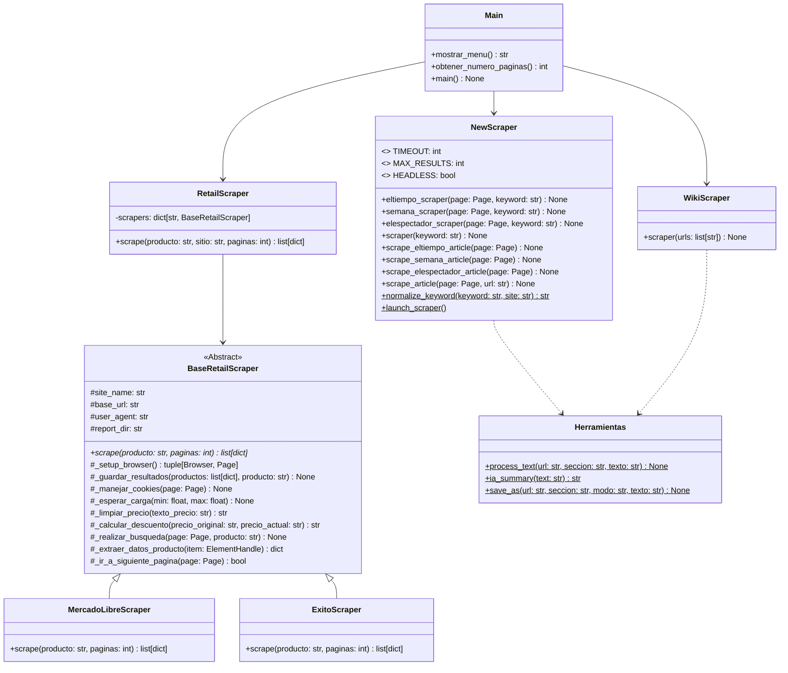

```mermaid
classDiagram
    class Main {
        +mostrar_menu() str
        +obtener_numero_paginas() int
        +main() None
    }

    class WikiScraper {
        +scraper(urls: list[str]) None
    }

    class NewScraper {
        <<static>> TIMEOUT: int
        <<static>> MAX_RESULTS: int
        <<static>> HEADLESS: bool
        +eltiempo_scraper(page: Page, keyword: str) None
        +semana_scraper(page: Page, keyword: str) None
        +elespectador_scraper(page: Page, keyword: str) None
        +scraper(keyword: str) None
        +scrape_eltiempo_article(page: Page) None
        +scrape_semana_article(page: Page) None
        +scrape_elespectador_article(page: Page) None
        +scrape_article(page: Page, url: str) None
        +normalize_keyword(keyword: str, site: str) str$
        +launch_scraper()$
    }

    class BaseRetailScraper {
        <<Abstract>>
        #site_name: str
        #base_url: str
        #user_agent: str
        #report_dir: str
        +scrape(producto: str, paginas: int) list[dict]*
        #_setup_browser() tuple[Browser, Page]
        #_guardar_resultados(productos: list[dict], producto: str) None
        #_manejar_cookies(page: Page) None
        #_esperar_carga(min: float, max: float) None
        #_limpiar_precio(texto_precio: str) str
        #_calcular_descuento(precio_original: str, precio_actual: str) str
        #_realizar_busqueda(page: Page, producto: str) None
        #_extraer_datos_producto(item: ElementHandle) dict
        #_ir_a_siguiente_pagina(page: Page) bool
    }

    class MercadoLibreScraper {
        +scrape(producto: str, paginas: int) list[dict]
    }

    class ExitoScraper {
        +scrape(producto: str, paginas: int) list[dict]
    }

    class RetailScraper {
        -scrapers: dict[str, BaseRetailScraper]
        +scrape(producto: str, sitio: str, paginas: int) list[dict]
    }

    class Herramientas {
        +process_text(url: str, seccion: str, texto: str) None$
        +ia_summary(text: str) str$
        +save_as(url: str, seccion: str, modo: str, texto: str) None$
    }

    Main --> WikiScraper
    Main --> NewScraper
    Main --> RetailScraper
    RetailScraper --> BaseRetailScraper
    BaseRetailScraper <|-- MercadoLibreScraper
    BaseRetailScraper <|-- ExitoScraper
    NewScraper ..> Herramientas
    WikiScraper ..> Herramientas
```
