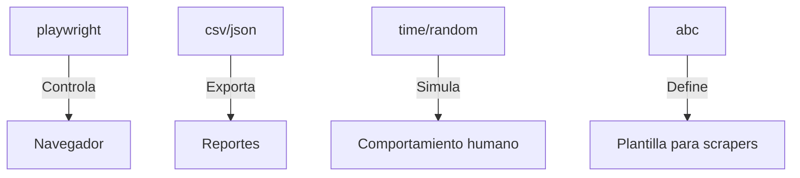

# Proyecto-Scrapers


Este proyecto utiliza **[Playwright](https://playwright.dev/python/)** para automatizar la navegación en páginas web con el objetivo de extraer información útil de manera estructurada. Está dividido en dos partes complementarias:

- **Parte 1 – Scraper Retail (sincrónico)**: Automatiza la extracción de productos desde tiendas online como **MercadoLibre** y **Éxito**.
- **Parte 2 – Scraper Wiki (asincrónico)**: Extrae información estructurada desde artículos de una Wiki.

Esto permite comparar dos enfoques distintos de programación (sincrónico y asincrónico), ambos usando Playwright con Python.

---

## 🤖 ¿Qué es Playwright?

Playwright es una herramienta poderosa que permite controlar navegadores como **Chromium, Firefox y WebKit** desde código. Sirve para:

- Automatizar pruebas web (como Selenium)
- Hacer scraping de sitios dinámicos (que cargan con JavaScript)
- Interactuar con elementos como botones, formularios, scrolls, etc.

Es compatible con múltiples lenguajes como **Python**, **JavaScript** y **C#**.  
En este proyecto usamos **Playwright para Python**.

---

## ¿Qué es programación Sincrónica y Asincrónica?

Playwright puede ejecutarse de dos maneras diferentes en Python:

| Tipo        | Descripción                                                                 |
|-------------|------------------------------------------------------------------------------|
|  **Sincrónica** | Ejecuta cada instrucción **una tras otra**, esperando a que termine para pasar a la siguiente. Más fácil de entender y depurar. Ideal para proyectos simples. |
|  **Asincrónica** | Permite realizar múltiples tareas al mismo tiempo usando `async/await`. Ideal para scraping en paralelo o cuando se necesitan muchas esperas. |

---

### Ejemplo de uso Sincrónico (como en el scraper retail):

```python
from playwright.sync_api import sync_playwright

with sync_playwright() as p:
    browser = p.chromium.launch()
    page = browser.new_page()
    page.goto("https://example.com")
    print(page.title())
    browser.close()
```
### Ejemplo de uso Asincrónico (como en el scraper wiki):

```python
from playwright.async_api import async_playwright
import asyncio

async def run():
    async with async_playwright() as p:
        browser = await p.chromium.launch()
        page = await browser.new_page()
        await page.goto("https://example.com")
        print(await page.title())
        await browser.close()

asyncio.run(run())
```
# Parte 1 - Scraper Retail
## Bibliotecas utilizadas
```python
from playwright.sync_api import sync_playwright
import csv
import time
import random
from datetime import datetime
import os
import json
from abc import ABC, abstractmethod
```
* **csv:** Generar archivos CSV (valores separados por comas) para exportar datos.
```python
with open("reporte.csv", "w") as file:
    writer = csv.DictWriter(file, fieldnames=["producto", "precio"])
    writer.writeheader()
    writer.writerow({"producto": "Zapatos", "precio": "$100"})
#producto,precio
#Zapatos,$100
```
*  **time:** Controlar tiempos de espera entre acciones.
*  **random:** Generar aleatoriedad en tiempos de espera y acciones.
*   **datetime:**
```python
timestamp = datetime.now().strftime("%Y%m%d_%H%M%S")
# Genera: "20240521_143022" (año, mes, día, hora, minuto, segundo)
```
se usa para nombres de archivos únicos (reporte_20240521.csv) y registro de cuándo se extrajeron los datos.
* **os:** Interactuar con el sistema operativo (archivos, rutas).
```python
os.makedirs("reportes", exist_ok=True)  # Crea carpeta si no existe
os.path.join("reportes", "data.csv")    # Genera rutas multiplataforma (Windows/Linux/Mac)
```
* **json:** Exportar datos en formato JSON (intercambio de datos con APIs o apps web).
```python
with open("data.json", "w") as file:
    json.dump(productos, file, indent=2)  # indent=2 para formato legible
#ejemplo de uso
#"producto": "iPhone 15",
#"precio": "$5.000.000"
```

## Clase Base abstracta: BaseRetailScraper
Propósito: Proporcionar una estructura común para scrapers de e-commerce con funcionalidades compartidas.
### 1.Inicializacion
```python
def __init__(self, site_name, base_url=None):
    self.site_name = site_name
    self.base_url = base_url
    self.user_agent = "Mozilla/5.0 (Windows NT 10.0...) AppleWebKit/537.36"
    self.viewport = {"width": 1366, "height": 768}
    self.report_dir = "reportes_retail"
    # Selectores (deben definirse en clases hijas)
    self.search_input_selector = None
    self.product_container_selector = None
    # ... (otros selectores)
```
#### Responsabilidades
* Configuración básica del navegador (User-Agent, resolución)
* Definición de selectores HTML (deben ser sobrescritos)
* Creación de carpeta para reportes (reportes_retail)
### 2. Método Abstracto Obligatorio
```python
@abstractmethod
def scrape(self, producto: str, paginas: int = 1):
    """Método principal a implementar por cada scraper concreto"""
    pass
```
#### ¿por qué?
* Estructura HTML única
* Flujos de navegación diferentes
