# Proyecto-Scrapers


Este proyecto utiliza **[Playwright](https://playwright.dev/python/)** para automatizar la navegación en páginas web con el objetivo de extraer información útil de manera estructurada. Está dividido en dos partes complementarias:

- **Parte 1 – Scraper Retail (sincrónico)**: Automatiza la extracción de productos desde tiendas online como **MercadoLibre** y **Éxito**.
- **Parte 2 – Scraper Wiki (asincrónico)**: Extrae información estructurada desde artículos de una Wiki.

Esto permite comparar dos enfoques distintos de programación (sincrónico y asincrónico), ambos usando Playwright con Python.

---

## 🤖 ¿Qué es Playwright?

Playwright es una herramienta poderosa que permite controlar navegadores como **Chromium, Firefox y WebKit** desde código. Sirve para:

- Automatizar pruebas web (como Selenium)
- Hacer scraping de sitios dinámicos (que cargan con JavaScript)
- Interactuar con elementos como botones, formularios, scrolls, etc.

Es compatible con múltiples lenguajes como **Python**, **JavaScript** y **C#**.  
En este proyecto usamos **Playwright para Python**.

---

## ¿Qué es programación Sincrónica y Asincrónica?

Playwright puede ejecutarse de dos maneras diferentes en Python:

| Tipo        | Descripción                                                                 |
|-------------|------------------------------------------------------------------------------|
|  **Sincrónica** | Ejecuta cada instrucción **una tras otra**, esperando a que termine para pasar a la siguiente. Más fácil de entender y depurar. Ideal para proyectos simples. |
|  **Asincrónica** | Permite realizar múltiples tareas al mismo tiempo usando `async/await`. Ideal para scraping en paralelo o cuando se necesitan muchas esperas. |

---

### Ejemplo de uso Sincrónico (como en el scraper retail):

```python
from playwright.sync_api import sync_playwright

with sync_playwright() as p:
    browser = p.chromium.launch()
    page = browser.new_page()
    page.goto("https://example.com")
    print(page.title())
    browser.close()
```
### Ejemplo de uso Asincrónico (como en el scraper wiki):

```python
from playwright.async_api import async_playwright
import asyncio

async def run():
    async with async_playwright() as p:
        browser = await p.chromium.launch()
        page = await browser.new_page()
        await page.goto("https://example.com")
        print(await page.title())
        await browser.close()

asyncio.run(run())
```
# Parte 1 - Scraper Retail
## Bibliotecas utilizadas
```python
from playwright.sync_api import sync_playwright
import csv
import time
import random
from datetime import datetime
import os
import json
from abc import ABC, abstractmethod
```
* **csv:** Generar archivos CSV (valores separados por comas) para exportar datos.
```python
with open("reporte.csv", "w") as file:
    writer = csv.DictWriter(file, fieldnames=["producto", "precio"])
    writer.writeheader()
    writer.writerow({"producto": "Zapatos", "precio": "$100"})
#producto,precio
#Zapatos,$100
```
*  **time:** Controlar tiempos de espera entre acciones.
*  **random:** Generar aleatoriedad en tiempos de espera y acciones.
*   **datetime:**
```python
timestamp = datetime.now().strftime("%Y%m%d_%H%M%S")
# Genera: "20240521_143022" (año, mes, día, hora, minuto, segundo)
```
se usa para nombres de archivos únicos (reporte_20240521.csv) y registro de cuándo se extrajeron los datos.
* **os:** Interactuar con el sistema operativo (archivos, rutas).
```python
os.makedirs("reportes", exist_ok=True)  # Crea carpeta si no existe
os.path.join("reportes", "data.csv")    # Genera rutas multiplataforma (Windows/Linux/Mac)
```
* **json:** Exportar datos en formato JSON (intercambio de datos con APIs o apps web).
```python
with open("data.json", "w") as file:
    json.dump(productos, file, indent=2)  # indent=2 para formato legible
#ejemplo de uso
#"producto": "iPhone 15",
#"precio": "$5.000.000"
```

## Clase Base abstracta: BaseRetailScraper
Propósito: Proporcionar una estructura común para scrapers de e-commerce con funcionalidades compartidas.
### 1.Inicializacion
```python
def __init__(self, site_name, base_url=None):
    self.site_name = site_name
    self.base_url = base_url
    self.user_agent = "Mozilla/5.0 (Windows NT 10.0...) AppleWebKit/537.36"
    self.viewport = {"width": 1366, "height": 768}
    self.report_dir = "reportes_retail"
    # Selectores (deben definirse en clases hijas)
    self.search_input_selector = None
    self.product_container_selector = None
    # ... (otros selectores)
```
#### Responsabilidades
* Configuración básica del navegador (User-Agent, resolución)
* Definición de selectores HTML (deben ser sobrescritos)
* Creación de carpeta para reportes (reportes_retail)
### 2. Método Abstracto Obligatorio
```python
@abstractmethod
def scrape(self, producto: str, paginas: int = 1):
    """Método principal a implementar por cada scraper concreto"""
    pass
```
#### ¿por qué?
* Estructura HTML única
* Flujos de navegación diferentes
### 3. Navegación y Browser
#### Configuración del Navegador
```python
def _setup_browser(self):
    browser = sync_playwright().start().chromium.launch(
        headless=False,
        args=['--disable-blink-features=AutomationControlled']
    )
```
##### Caracteristicas Clave
* Pantalla visible
* Evitar ser detectados
* Configuraacion regional
#### Busqueda de productos
```python
def _realizar_busqueda(self, page, producto):
    search_input = page.wait_for_selector(self.search_input_selector)
    search_input.fill(producto)
```
* Espera campo de busqueda
* Busca el producto
### 4. Manejo de Datos
#### Extracción Estructurada
```python
def _extraer_datos_producto(self, item):
    return {
        "producto": nombre,
        "precio_actual": f"${precio} COP",
        "descuento": descuento,
        # ... (otros campos)
    }
```
* Cálculo de descuentos si no estan visible
* url al producto
#### Exportación de Resultados
```python
def _guardar_resultados(self, productos: list, producto: str):
    # CSV
    with open(f"{nombre_archivo}.csv", "w") as file:
        writer = csv.DictWriter(...)
    # JSON
    with open(f"{nombre_archivo}.json", "w") as file:
        json.dump(...)
```
* CSV: Para análisis en Excel/Google Sheets
* JSON: Para integraciones con otras aplicaciones
### 5. Utilidades Avanzadas
#### Manejo de errores
```python
def _ir_a_siguiente_pagina(self, page):
    try:
        next_btn = page.locator(self.next_page_selector)
        next_btn.click(force=True)
    except Exception as e:
        print(f"Error: {str(e)}")
        return False
```
* Verifica existencia de botón
* Fuerza clics si es necesario
* Registra errores sin detener la ejecución
#### Anti-Detección
```python
def _esperar_carga(self, min=2, max=4):
    delay = random.uniform(min, max)
    time.sleep(delay)
```
* Esperas aleatorias entre acciones
* Simula velocidad humana de navegación
## ¿Comó funciona?

```mermaid
flowchart TD
    A[Inicio] --> B[setup_browser]
    B --> C[realizar_busqueda]
    C --> D[extraer_datos_producto]
    D --> E{¿Más páginas?}
    E -->|Sí| F[ir_a_siguiente_pagina]
    E -->|No| G[guardar_resultados]
```

##Ejemplo de scraper - Mercado Libre
```python
class MercadoLibreScraper(BaseRetailScraper):
    """Scraper especializado para Mercado Libre Colombia"""
    
    def __init__(self):
        super().__init__("MercadoLibre", "https://www.mercadolibre.com.co")
        
        # Definición de selectores específicos
        self.search_input_selector = "input.nav-search-input"
        self.search_button_selector = None  # Se usa Enter
        self.product_container_selector = "div.ui-search-result"
        self.product_name_selector = "h2.ui-search-item__title"
        self.product_price_selector = "span.andes-money-amount__fraction"
        self.product_original_price_selector = "s.andes-money-amount__fraction"
        self.product_link_selector = "a.ui-search-link"
        self.product_discount_selector = "span.ui-search-price__discount"
        self.next_page_selector = "li.andes-pagination__button--next a"
        self.cookie_accept_selector = "button.cookie-consent-banner-opt-out__action"
```
* Selectores actualizados
* Busqueda por enter
### Metodo scrape(donde esta la magia)
#### 1. Inicialización del Browser
```python
browser, page = self._setup_browser()
```
* Lanza un navegador Chromium
* Crea una nueva pestaña (page) lista para navegar.
#### 2. Navegación Inicial
```python
page.goto(self.base_url, timeout=60000)
self._manejar_cookies(page)
```
* Carga la página principal de Mercado Libre.
* Intenta cerrar el popup de cookies (si existe).
#### 3. Búsqueda Mágica
```python
self._realizar_busqueda(page, "iPhone 15")
```
* Localiza el input de búsqueda usando self.search_input_selector.
* Simula escritura humana con .fill() + _esperar_carga().
#### 4. Extracción de Productos
```python
items = page.query_selector_all(self.product_container_selector)
for item in items:
    producto_data = self._extraer_datos_producto(item)
```
* query_selector_all(): Captura todos los contenedores de productos (ej: "<div class="ui-search-result"">).
* _extraer_datos_producto() por cada ítem:
#### Paginación Automática
```python
if pagina_actual < paginas and not self._ir_a_siguiente_pagina(page):
    break
```
* Usa self.next_page_selector (li.andes-pagination__button--next a).
* Hover + Click forzado: Simula comportamiento humano real.
## RetailScraper(orquestador)
```python
  def scrape(self, producto: str, sitio: str, paginas: int = 1):
        sitio = sitio.lower()  # Obtiene MercadoLibreScraper o ExitoScraper
        if sitio in self.scrapers:
            return self.scrapers[sitio].scrape(producto, paginas) # Delega el trabajo al scraper específico
```
#Asi finalmente culmina la magia del scraper
